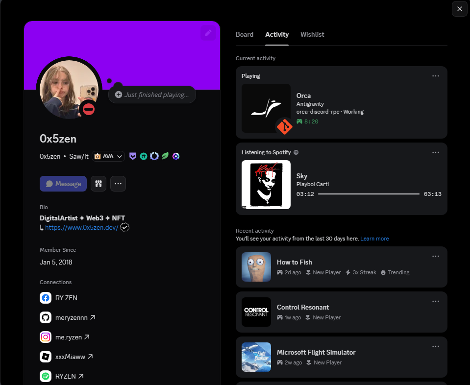

<div align="center">

# orca-discord-rpc


### Discord Rich Presence for [Orca](https://github.com/stablyai/orca)
Shows your active workspace and running agents directly on your Discord profile in real time.

[](https://github.com/meryzennn/orca-discord-rpc/releases/latest)
[](LICENSE)

</div>

---

## 📸 Discord Profile Preview

<p align="center">
  
</p>

> **Live Rich Presence**: Displays your featured active agent (`Claude`, `Codex`, etc.), any background agents (`+1`), the active workspace folder name, status (`Working` / `Idle`), elapsed session time, and the current git branch badge.

---

## ✨ What's New

- 🚀 **Ultra-Lightweight**: Built-in working-set auto-trimming via native Win32 `SetProcessWorkingSetSize` periodically flushes unused memory pages in the background, keeping memory footprint minimal.
- 📦 **100% Pure Portable App**: No installer and no `%LOCALAPPDATA%` file duplication. Extract `OrcaPresence.exe` anywhere and run it immediately.
- 🔄 **Automatic Background Update Checks**: Silently checks for newer GitHub releases in the background and surfaces an update notification directly in the tray menu with a 1-click download option.
- ⭐ **Star on GitHub Tray Button**: Quick access with a custom golden star icon right in the tray context menu to easily support the repo.
- 🔔 **Startup & Duplicate Launch Notifications**: Informative balloon notification on startup and duplicate instance protection to prevent conflicts.
- 🗜️ **Clean Native Zip Packaging**: Releases are cleanly packaged without `./` root paths, eliminating WinRAR extraction folder errors.

---

## ⚡ Install & Usage (Windows, C# App)

`OrcaPresence` is fully portable and requires no installation:

1. **Download**: Grab `OrcaPresence-windows.zip` from the [**Latest Releases**](https://github.com/meryzennn/orca-discord-rpc/releases/latest).
2. **Extract & Run**: Extract the zip file anywhere (e.g., `C:\Tools\OrcaPresence` or your Desktop) and double-click `OrcaPresence.exe`.
3. **Tray Icon**: The app runs silently in the system tray (notification area).
4. **Auto-Start with Windows**: Right-click the tray icon and check **Start with Windows** to automatically launch it upon login.

To uninstall, simply uncheck **Start with Windows** and delete the application folder.

### Optional CLI Commands

You can also manage auto-start directly from PowerShell or Command Prompt:

```sh
OrcaPresence.exe autostart enable    # Enables auto-start on Windows login for this executable
OrcaPresence.exe autostart disable   # Disables auto-start
OrcaPresence.exe autostart status    # Shows whether autostart is currently enabled
```

*No administrative privileges required: configuration is stored in the user's `HKEY_CURRENT_USER` registry hive.*

> **Single Instance**: Only one copy may run at a time. A second launch displays a notification and exits immediately, preventing conflicting updates to your Discord profile.

---

## 📋 Requirements

- **Orca installed**, with the `orca` CLI resolvable on `PATH`
- **Discord desktop client running and logged in** — the web browser version of Discord does not expose the local IPC socket required for Rich Presence.
- **Windows**: The C# app targets .NET Framework 4.8 (pre-installed on Windows 10/11) with zero runtime dependencies.
- *(Optional)* **Node.js 24+**: Only required if running the headless Node daemon on macOS / Linux.

---

## 🔍 What Discord Shows

| Field | Content |
| --- | --- |
| Line 1 | The featured agent, plus `+N` when other agent panes are open — `Claude +1` |
| Line 2 | The workspace folder, then `Working` or `Idle` |
| Timer | Elapsed session time (continues across workspaces and agents) |
| Small image | A branch icon; its tooltip is the branch name |

- **Featured Agent**: The agent that most recently entered its state — opening Codex shows `Codex`, and its name stays there while waiting between turns. An active working agent takes precedence over an idle agent. `+N` counts every agent whose pane is open.
- **Folder**: The active workspace folder name taken from the Orca workspace path.
- **Branch**: Displays the git branch name in the small badge tooltip.

---

## 🖱️ Tray Menu

Right-click the system tray icon to view status and controls:

| Row | Meaning |
| --- | --- |
| `Claude` | Healthy — current agent displayed on profile |
| `Discord not detected` | Orca is open, Discord is not; a **Reconnect** button appears |
| `Orca is not running` | Waiting for Orca to launch |
| `Presence paused` | Presence is temporarily paused; click **Enable presence** to resume |
| `Problem` | Displays error reason if the last update failed |
| ⭐ **Star on GitHub** | Opens the project repository in your default browser |
| 🔄 **Download Update (vX.Y.Z)** | Appears automatically when a newer version is available |

The tray menu also allows you to toggle **Start with Windows**, toggle presence, reconnect to Discord, and view the active Application ID.

---

## 📊 Size & Performance

The C# WinForms app is drastically smaller and lighter than typical Electron-based RPC tools:

| Metric | C# App (`OrcaPresence`) | Headless Node | Electron (Retired) |
| --- | --- | --- | --- |
| **Download / Published Size** | **~1.7 MB** (single exe: 580 KB) | ~25 MB (`node_modules`) | 106 MB installer |
| **RAM Usage** | **Lightweight** (auto-trimmed) | Moderate | Heavy (~200+ MB) |
| **Background Processes** | **1** | 1 | 3 |

*Working-set auto-trimming periodically flushes unneeded pages back to the OS in the background to maintain a minimal memory footprint.*

---

## 🎨 Custom Artwork & Configuration

A default Discord Application ID is pre-configured out of the box. To customize your own Discord app ID or registered art:

```sh
setx ORCA_DISCORD_CLIENT_ID "123456789012345678"
setx ORCA_DISCORD_UPLOADED_ART "1"
```

Or via JSON config file (`%LOCALAPPDATA%\orca-discord-rpc\config.json`):

```json
{
  "clientId": "123456789012345678",
  "pollMs": 15000,
  "useUploadedArt": true
}
```

`pollMs` is clamped to at least 5 seconds. The default 15 s stays well inside Discord's rate limit of roughly 5 updates per 20 seconds.

---

## 🛠️ Build & Development

### Building the C# App

```sh
npm run build:csharp                    # Generates icons and publishes to dist-csharp
npm run pack:csharp                     # Compiles and packs clean OrcaPresence-windows.zip
dotnet test csharp/OrcaPresence.Tests   # 100 unit tests
```

### Running the Headless Daemon (macOS / Linux / Scripted)

```sh
npm install
npm start          # Starts daemon, logging to daemon.log
npm test           # Runs node --test suite (125 tests)
npm run typecheck
```

---

## ⚙️ How It Works

```
orca worktree ps --json ──► parse ──► select the active worktree
                                            │
                       folder + open agents ──► dedup by payload
                                            │
                 hand-rolled Discord IPC ──► the local named pipe
```

- **IPC Named Pipe**: The C# app speaks directly to Discord's local Windows named pipe (`\\.\pipe\discord-ipc-0`) with zero external Discord SDK dependencies.
- **Smart Polling**: Polls Orca CLI on a configurable timer (default 15s). Discord updates are sent only when payload changes, respecting rate limits.
- **Auto Recovery**: Automatically reconnects when Discord or Orca restarts.
- **Quiet Failures**: Diagnostics are written to `tray.log` (C# app) or `daemon.log` (CLI).

---

## 📄 License

MIT — see [LICENSE](LICENSE).
